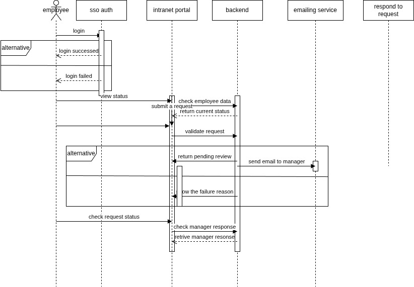
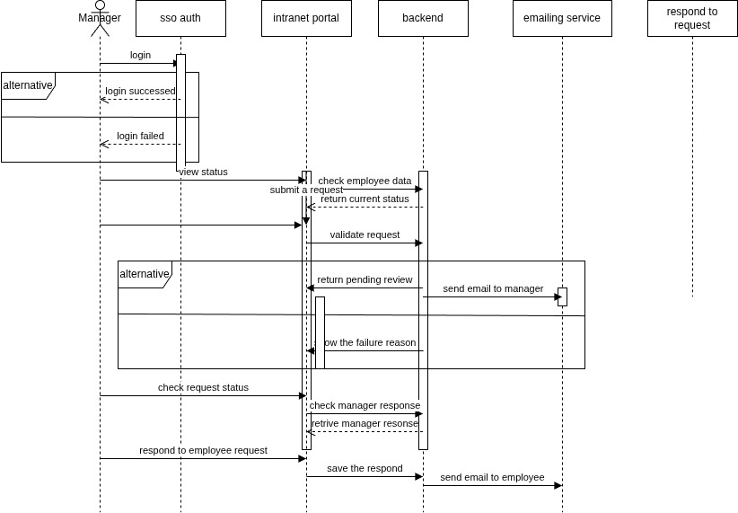

# VACATION TRACKING SYSTEM (VTS)
This will include the following:
- Domain.
- List of actors.
- manage time diagrams:
  - class diagram.
  - sequence diagram
  - flow chart
- pseudocode for manage diagram functionality.

## Domain (what is the problem?)
A Vacation Tracking System (VTS) will provide individual employees with the
capability to manage their own vacation time, sick leave, and personal time off,
without having to be an expert in company policy or the local facility’s leave
policies.The main goal of this application is to improve the internal business processes of
the organization, at least with respect to the time it takes to manage vacation time
requests. In the past, all vacation time had to be approved by an immediate manager and then checked by a clerk in the HR department before it was authorized.
Sometimes this manual process could take days. An automated system will speed
up this process and will require at most one manual approval by the immediate
manager.

## List of actors
- Employee: The main user of this system. An employee uses this system to
manage his or her vacation time.
- Manager: An employee who has all the abilities and goals of a regular
employee, but with the added responsibility of approving vacation requests
for immediate subordinates. A manager may award subordinates comp
time, subject to certain limits set in the system.
- Clerk(HR): A member of the HR department who has sufficient rights to view
employees’ personal data and is responsible for ensuring that employees’
information in all HR systems is up to date and correct. An HR clerk can
add or remove nearly any record in the system.
- System Admin: A role responsible for the smooth running of the system’s technical resources (e.g., Web server, database) and for collecting and
archiving all log files.

## manage time diagrams

### class diagram


### sequence diagram
#### employee sequence diagram


#### manager sequence diagram


### flow chart


## manage time pseudocode
``` pseudocode
Enter your credentials
If credentials are right, show the employee status data
Else return invalid credentials
Submit a request(catalof, commit,date)
Validate the request
If validation failed, return the failure reason
Else return pending review and send an email to the appropriate manager.
If the user is a manager
show request appending respond
Respond to the request and send an email to the employee
If user is not manager
END
```
